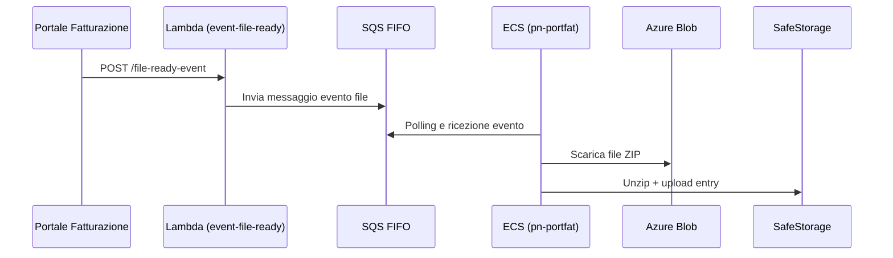
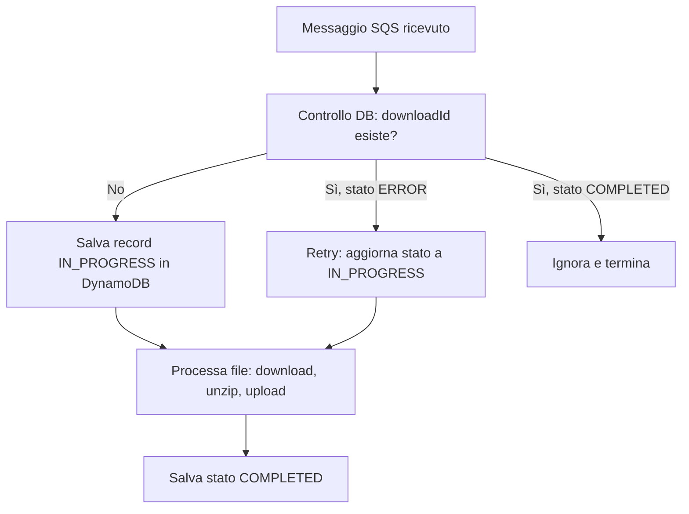
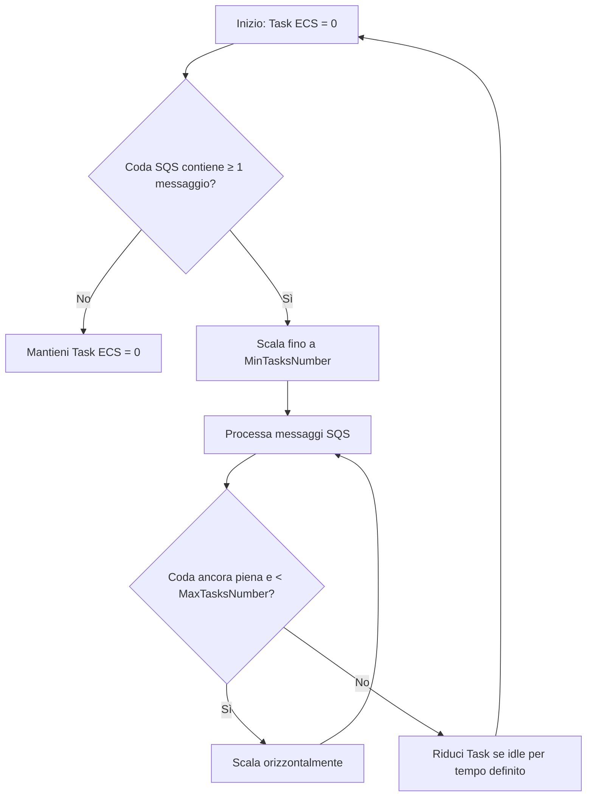

# pn-portfat

[](https://travis-ci.com/organization/repo)
[](LICENSE)

Microservizio di backend sviluppato in Spring Boot WebFlux per ricevere, elaborare e archiviare file `.zip` inviati dal Portale di Fatturazione al fine di integrarli con il sistema SEND di pagoPA.

## Panoramica

Il progetto realizza un'integrazione asincrona tra il **Portale di Fatturazione** e la piattaforma **SEND**. Si compone di:

- AWS **Lambda** (`event-file-ready`) che riceve gli eventi e li pubblica su una coda FIFO;
- Coda **SQS FIFO** con meccanismi di deduplicazione e retry;
- Microservizio **ECS** `pn-portfat`, che scarica e processa i file `.zip`, salvando i dati su **SafeStorage**.

## Confini e responsabilità

- **Responsabilità:** ricezione eventi, deduplicazione, validazione, estrazione file JSON, archiviazione.
- **Dipendenze:** AWS Lambda, SQS, DynamoDB, Azure Blob Storage, SafeStorage.

### Architettura



## Prerequisiti

- Java 17+
- Node.js 20+
- Docker 27+

## Installazione

### Ambiente Locale
```bash
    git clone https://github.com/pagopa/pn-portfat.git
    cd pn-portfat
    ./mvnw clean install
```

## Configurazione

Il microservizio utilizza i seguenti parametri di configurazione, gestibili tramite:

1. **Variabili d'ambiente** (preferite per deployment cloud)

| Variabile Ambiente          | Descrizione                               | Obbligatorio |
|----------------------------|-------------------------------------------|--------------|
| `BLOB_STORAGE_BASE_URL`    | URL base per validazione del download URL | Sì           |
| `SAFE_STORAGE_URL`         | Endpoint SafeStorage                      | Sì           |
| `DYNAMO_TABLE_NAME`        | Nome della tabella per la deduplicazione  | Sì           |
| `SQS_QUEUE_NAME`           | Nome della coda dalla quale leggere       | Sì           |

2. **File di configurazione estratto da `application.yml` (Spring Boot):**

```yaml
pn:
  portfat:
    sqsQueue: ${PN_PORTFAT_AWS_SQS_NAME}
    blobStorageBaseUrl: ${PN_PORTFAT_BLOB_STORAGE_BASE_URL}
    filePathWhiteList: temp, portfatt, port-fatt
    basePathZipFile: port-fat-zips
    zipExtension: .zip
    clientSafeStorageBasePath: ${PN_PORTFAT_SAFESTORAGEBASEURL}
    safeStorageCxId: ${PN_PORTFAT_SAFESTORAGECXID}

aws:
  dynamodbPortFatTable: ${PN_PORTFAT_PORTFAT_TABLE_NAME}
```

3. **File di configurazione estratto da `config.json` (Node.js):**
```json
{
   "PN_PORTFAT_AWS_REGION": "PN_PORTFAT_AWS_REGION",
   "PN_PORTFAT_SQS_QUEUE_URL": "PN_PORTFAT_SQS_QUEUE_URL",
   "PN_PORTFAT_SQS_QUEUE_NAME": "PN_PORTFAT_SQS_QUEUE_NAME",
}
```

### Configurazione Base

| Variabile Ambiente          | File Property                  | Default       | Obbligatorio | Descrizione                               |
|----------------------------|--------------------------------|---------------|--------------|-------------------------------------------|
| `SERVER_PORT`              | `server.port`                 | 8080          | No           | Porta del servizio                       |
| `LOG_LEVEL`                | `logging.level.root`          | INFO          | No           | DEBUG/INFO/WARN/ERROR                    |


## API Documentation

**OpenAPI Spec**: disponibile nel file [`docs/openapi/pn-external-portfat-v1.yaml`](./docs/openapi/pn-external-portfat-v1.yaml)

L'interfaccia principale è rappresentata dalla Lambda `event-file-ready` che espone una API REST pubblica:

- `POST /pn-portfat-in/file-ready-event` - Riceve eventi inerenti file prodotti dal Portale Fatturazione

### 1. Lambda `event-file-ready`

- Linguaggio: Node.js
- Espone l'endpoint `POST /pn-portfat-in/file-ready-event`
- Riceve un evento contenente `downloadUrl` e `fileVersion`
- Invia sulla coda SQS messaggi contenenti `downloadUrl`, `fileVersion` e `filePath`
- `filePath` è utilizzato come `MessageGroupId` per garantire l'elaborazione sequenziale per singolo file

### 2. Coda SQS FIFO
- Nome: `pn-portfat_request_actions.fifo`
- Deduplicazione temporale abilitata, valida fino a 5 minuti se il contenuto del messaggio è identico
- Il `VisibilityTimeout` è impostato a **1200 secondi (20 minuti)**: se un messaggio non viene completato entro questo tempo, viene riproposto
- Dopo **5 tentativi falliti**, il messaggio passa automaticamente nella **DLQ** (Dead Letter Queue)

#### Struttura dei messaggi

Ogni messaggio inviato sulla coda SQS è un oggetto JSON con la seguente struttura:

```json
{
  "downloadUrl": "https://...",
  "fileVersion": "2025-01",
  "filePath": "/ordinativi/ente1/2025-01.zip"
}
```

- `downloadUrl`: URL firmato temporaneo (SAS) per scaricare il file ZIP da Azure Blob.
- `fileVersion`: identificatore di versione usato per la deduplicazione.
- `filePath`: path logico utile per validazioni e ordinamento.

### 3. Microservizio ECS `pn-portfat`

#### Funzionalità principali:
- Consuma i messaggi dalla coda SQS FIFO
- Valida se `downloadUrl` deve iniziare con `blobStorageBaseUrl`
- Valida se `filePath` deve essere nella `filePathWhiteList`
- Deduplica tramite DynamoDB (`pn-PortfatDownload`) usando `downloadId`
- Scarica file da Azure Blob con SAS
- Esegue unzip del file
- Carica le singole entry su SafeStorage, con tagging semantico

#### SafeStorage e Tagging

Ogni file `.json` estratto viene:

- Caricato su SafeStorage tramite API `POST /safe-storage/v1/files`
- Associato seguenti metadati:
    - `sender_pa_id`
    - `reference_period_year_month`
    - `original_data_update_timestamp`

### 4. Deduplicazione & Sicurezza

- La deduplicazione persistente è garantita tramite la tabella DynamoDB.



### 5. ECS Autoscaling Policy
Il microservizio pn-portfat è configurato per scalare automaticamente in base alla presenza di messaggi nella coda SQS.

L’istanza ECS parte da 0 task attivi.

Quando è presente almeno 1 messaggio nella coda viene attivato un task.

Il controllo della coda avviene ogni 300 secondi (5 minuti).

Il numero massimo di task contemporanei è 6, mentre il minimo garantito è 1.



### 6. Scenari di errore gestiti

| Caso                        | Effetto                                        |
|-----------------------------|------------------------------------------------|
| Azure irraggiungibile       | Stato = `ERROR` in DB                          |
| File ZIP corrotto           | Stato = `ERROR` in DB                          |
| File non JSON nel .zip      | Stato = `ERROR` in DB                          |
| SafeStorage irraggiungibile| Stato = `ERROR` in DB                          |

### 7. Mappa delle responsabilità

| Componente                  | Responsabilità principali                                                                 |
|----------------------------|--------------------------------------------------------------------------------------------|
| Portale Fatturazione       | Invio evento HTTP con `downloadUrl` e `fileVersion`                                        |
| Lambda `event-file-ready`  | Valida input, pubblica su SQS FIFO                                                        |
| Coda SQS FIFO              | Deduplica temporale, garantisce ordine e retry                                            |
| ECS `pn-portfat`           | Scarica file, unzip, carica entry su SafeStorage, aggiorna stato                         |
| SafeStorage                | Archivia file JSON, supporta tagging semantico                                            |
| DynamoDB                   | Memorizza stato `IN_PROGRESS`, `COMPLETED`, `ERROR`                                       |

## Test

### Esecuzione Test
```bash
    ./mvnw verify
```

## Locale
### Esecuzione in locale
```bash
    ./mvnw spring-boot:run -Dspring-boot.run.profiles=local
```