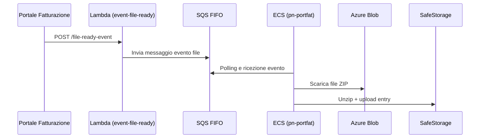
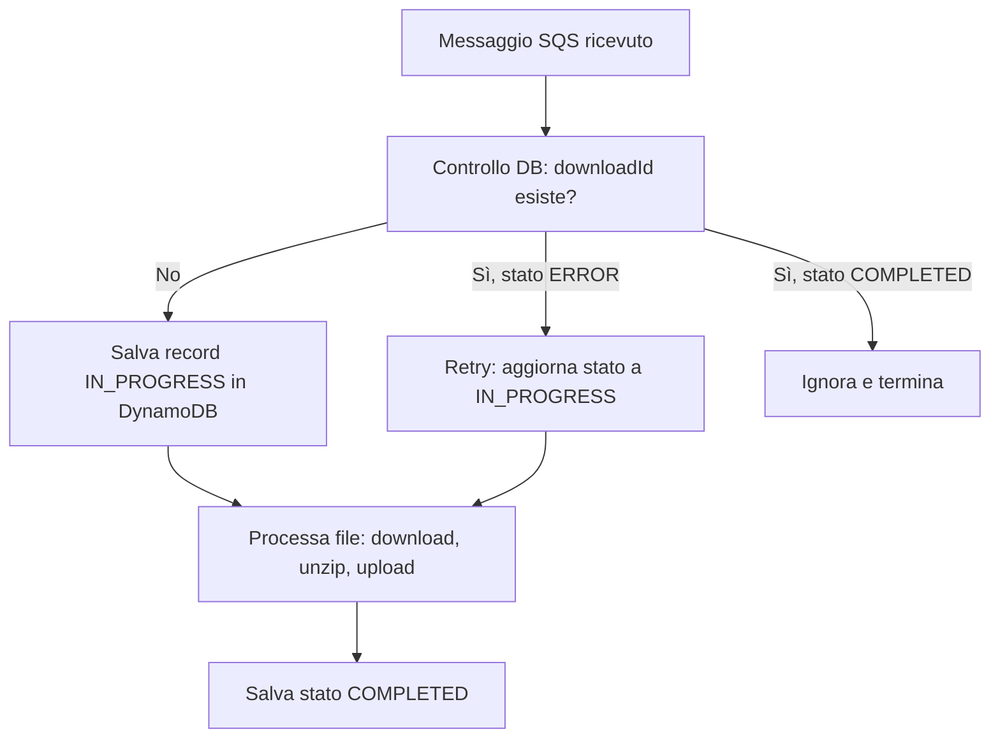
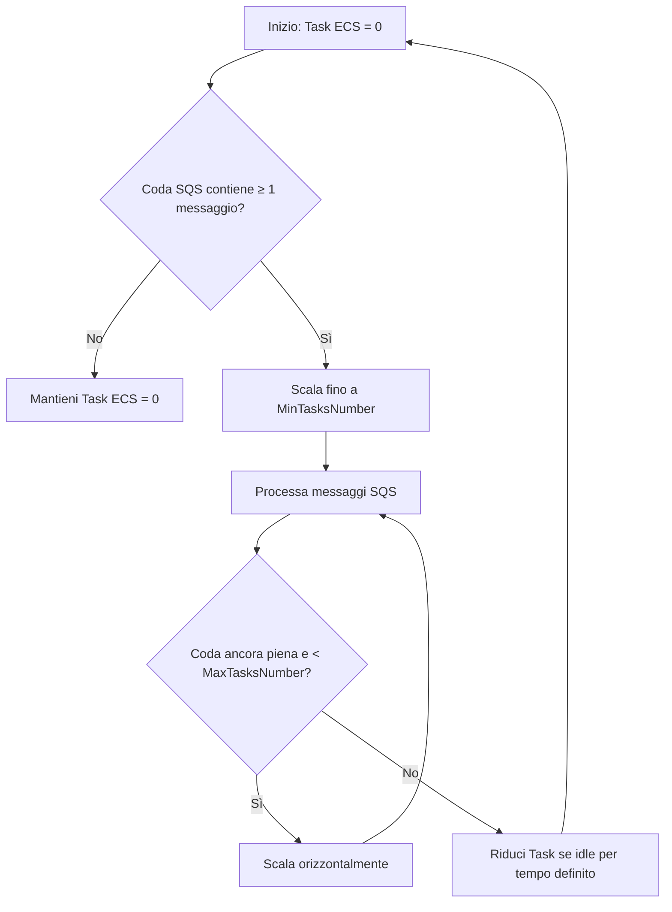

# pn-portfat

## Indice
- [Descrizione](#descrizione)
- [Tecnologie Utilizzate](#tecnologie-utilizzate)
- [Architettura](#architettura)
- [Interfacce del Servizio](#interfacce-del-servizio)
- [Configurazioni](#configurazioni)
- [Allarmi e Monitoraggio](#allarmi-e-monitoraggio)
- [Esecuzione](#esecuzione)

---

## Descrizione

Il servizio `pn-portfat` realizza l'integrazione asincrona tra il Portale di Fatturazione e la piattaforma SEND di pagoPA per 
ricevere eventi di disponibilità file, scaricare archivi `.zip`, deduplicare le richieste di elaborazione, archiviare lo ZIP originale su SafeStorage, estrarre i file `.json` contenuti nell'archivio e caricare i singoli contenuti elaborati su SafeStorage. 
Il Portale di Fatturazione invoca la Lambda `event-file-ready`, che pubblica gli eventi su code SQS FIFO consumate dal microservizio Java eseguito su ECS; 
il servizio usa DynamoDB per tracciare lo stato dei download e chiama SafeStorage per archiviazione, recupero e upload dei contenuti.

---

## Tecnologie Utilizzate

### Stack Tecnologico

* Java 17+
* Spring Boot 3 / Spring WebFlux
* Spring Cloud AWS SQS
* Node.js 20.x per la Lambda `event-file-ready`
* OpenAPI 3.0.1 con generazione client/server tramite `openapi-generator-maven-plugin`
* Azure Storage Blob client
* Apache Commons Compress per gestione archivi ZIP
* Testcontainers e LocalStack per test con servizi AWS locali

### Infrastruttura

* AWS Lambda
* AWS API Gateway
* AWS SQS FIFO con DLQ
* AWS ECS Fargate
* AWS DynamoDB
* AWS CloudWatch Logs, Dashboard e Alarm
* SafeStorage
* Azure Blob Storage

---

## Architettura

Il flusso principale parte dalla ricezione dell'evento HTTP di file pronto, prosegue con la pubblicazione su SQS FIFO, la deduplicazione su DynamoDB, l'archiviazione dello ZIP originale su SafeStorage e la successiva elaborazione dei JSON estratti a seguito della callback SafeStorage. La documentazione di dettaglio è disponibile in [**Architettura interna**](docs/ms/architettura_interna.md).


```mermaid
sequenceDiagram
    participant Portale Fatturazione
    participant Lambda (event-file-ready)
    participant SQS FIFO
    participant ECS (pn-portfat)
    participant Azure Blob
    participant SafeStorage

    Portale Fatturazione->>Lambda (event-file-ready): POST /file-ready-event
    Lambda (event-file-ready)->>SQS FIFO: Invia messaggio evento file
    ECS (pn-portfat)->>SQS FIFO: Polling e ricezione evento
    ECS (pn-portfat)->>Azure Blob: Scarica file ZIP
    ECS (pn-portfat)->>SafeStorage: Unzip + upload entry
```

La deduplicazione persistente è basata sulla tabella DynamoDB `PortFatDownload`, che mantiene lo stato del download e permette di ignorare elaborazioni già completate o riprovare quelle terminate in errore.


```mermaid
flowchart TD
    A[Messaggio SQS ricevuto] --> B[Controllo DB: downloadId esiste?]
    B -- No --> C[Salva record IN_PROGRESS in DynamoDB]
    C --> D[Processa file: download, unzip, upload]
    D --> E[Salva stato COMPLETED]
    B -- Sì, stato ERROR --> F[Retry: aggiorna stato a IN_PROGRESS]
    F --> D
    B -- Sì, stato COMPLETED --> G[Ignora e termina]
```

Il microservizio è configurato per scalare automaticamente in base alla quantità di messaggi presenti nella coda SQS FIFO di ingresso; i parametri CloudFormation indicano `MinTasksNumber` pari a `1`, `MaxTasksNumber` pari a `6` e periodo di controllo pari a `300` secondi.


```mermaid
flowchart TD
    A[Inizio: Task ECS = 0] --> B{Coda SQS contiene ≥ 1 messaggio?}
    B -- No --> C[Mantieni Task ECS = 0]
    B -- Sì --> D[Scala fino a MinTasksNumber]
    D --> E[Processa messaggi SQS]
    E --> F{Coda ancora piena e < MaxTasksNumber?}
    F -- Sì --> G[Scala orizzontalmente]
    F -- No --> H[Riduci Task se idle per tempo definito]
    G --> E
    H --> A
```

---

## Interfacce del Servizio

| Tipo  | Dir | Risorsa                          | Protocollo | Metodo  | Route                                  | Descrizione                                                                                                                                                 |
|-------|-----|----------------------------------|------------|---------|----------------------------------------|-------------------------------------------------------------------------------------------------------------------------------------------------------------|
| API   | IN  | Portale Fatturazione             | REST       | POST    | `/pn-portfat-in/file-ready-event`      | Riceve l'evento di disponibilità file con `downloadUrl` e `fileVersion`; la Lambda calcola `filePath` dal pathname dell'URL e pubblica il messaggio su SQS. |
| API   | IN  | HealthCheck                      | REST       | GET     | `/status`                              | Restituisce lo stato applicativo del servizio.                                                                                                              |
| API   | OUT | SafeStorage upload               | REST       | POST    | `/safe-storage/v1/files`               | Crea file su SafeStorage per ZIP originale e JSON estratti, includendo SHA-256 e metadati applicativi.                                                      |
| API   | OUT | SafeStorage download             | REST       | GET     | `/safe-storage/v1/files/{fileKey}`     | Recupera tramite client generato `FileDownloadApi.getFile` l'URL temporaneo di download associato alla chiave SafeStorage dello ZIP archiviato.             |
| EVENT | OUT | `PortFatRequestActionsQueue`     | SQS        | PRODUCE | `pn-portfat_request_actions.fifo`      | La Lambda `event-file-ready` pubblica il messaggio `{downloadUrl, fileVersion, filePath}` con `MessageGroupId` uguale a `filePath`.                         |
| EVENT | OUT | `PortFatRequestActionsMockQueue` | SQS        | PRODUCE | `pn-portfat_request_actions_mock.fifo` | La Lambda pubblica sulla coda mock quando il payload contiene il flag mock gestito dal codice Lambda.                                                       |
| EVENT | IN  | `PortFatRequestActionsQueue`     | SQS        | CONSUME | `pn-portfat_request_actions.fifo`      | `QueueListener` consuma gli eventi di file pronto, valida URL/path/versione, crea o aggiorna lo stato DynamoDB e archivia lo ZIP su SafeStorage.            |
| EVENT | IN  | `PortFatRequestActionsMockQueue` | SQS        | CONSUME | `pn-portfat_request_actions_mock.fifo` | `QueueListener` consuma gli eventi mock e archivia lo ZIP con document type mock.                                                                           |
| EVENT | IN  | `SafeStorageToPortfatQueue`      | SQS        | CONSUME | `safestorage-to-portfat`               | `SafeStorageToPortfatQueueListener` consuma la callback SafeStorage, scarica lo ZIP archiviato, estrae i JSON e carica i contenuti su SafeStorage.          |
| EVENT | IN  | `SafeStorageToPortfatMockQueue`  | SQS        | CONSUME | `safestorage-to-portfat-mock`          | `SafeStorageToPortfatQueueListener` consuma la callback mock SafeStorage ed elabora lo ZIP in modalità mock.                                                |

OpenAPI:

* [docs/openapi/pn-external-portfat-v1.yaml](docs/openapi/pn-external-portfat-v1.yaml)
* [docs/openapi/pn-internal-portfat-v1.yaml](docs/openapi/pn-internal-portfat-v1.yaml)

---

## Configurazioni

| Nome                                               | Sorgente       | Valori                               | Descrizione                                                                                       |
|----------------------------------------------------|----------------|--------------------------------------|---------------------------------------------------------------------------------------------------|
| `PN_PORTFAT_AWS_SQS_NAME`                          | ENV            | Nome coda SQS                        | Coda FIFO da cui il microservizio consuma gli eventi di file pronto.                              |
| `PN_PORTFAT_MOCK_AWS_SQS_NAME`                     | ENV            | Nome coda SQS mock                   | Coda FIFO mock da cui il microservizio consuma gli eventi di file pronto in modalità mock.        |
| `PN_PORTFAT_SQS_SAFESTORAGETOPORTFATQUEUENAME`     | ENV            | Nome coda SQS                        | Coda da cui il microservizio consuma le callback SafeStorage relative agli ZIP archiviati.        |
| `PN_PORTFAT_SQS_SAFESTORAGETOPORTFATMOCKQUEUENAME` | ENV            | Nome coda SQS mock                   | Coda mock da cui il microservizio consuma le callback SafeStorage.                                |
| `PN_PORTFAT_BLOB_STORAGE_BASE_URL`                 | ENV            | URL base Azure Blob Storage          | Base URL ammesso per validare il `downloadUrl` ricevuto negli eventi del Portale di Fatturazione. |
| `PN_PORTFAT_SAFESTORAGEBASEURL`                    | ENV            | URL SafeStorage                      | Base URL usata dal client SafeStorage per creazione e recupero file.                              |
| `PN_PORTFAT_SAFESTORAGECXID`                       | ENV            | `pn-portfat-in` o valore configurato | Identificativo client usato nelle chiamate SafeStorage.                                           |
| `PN_PORTFAT_PORTFAT_TABLE_NAME`                    | ENV            | Nome tabella DynamoDB                | Tabella `PortFatDownload` usata per deduplicazione e stato del download.                          |
| `PN_PORTFAT_AWS_REGION`                            | ENV            | Regione AWS                          | Regione usata dalla Lambda `event-file-ready` per inizializzare il client SQS.                    |
| `PN_PORTFAT_SQS_QUEUE_NAME`                        | ENV            | Nome coda SQS                        | Nome logico della coda di ingresso configurato nella Lambda `event-file-ready`.                   |
| `PN_PORTFAT_SQS_QUEUE_URL`                         | ENV            | URL coda SQS                         | URL della coda di ingresso usato dalla Lambda per pubblicare messaggi.                            |
| `PN_PORTFAT_MOCK_SQS_QUEUE_NAME`                   | ENV            | Nome coda SQS mock                   | Nome logico della coda mock configurato nella Lambda `event-file-ready`.                          |
| `PN_PORTFAT_MOCK_SQS_QUEUE_URL`                    | ENV            | URL coda SQS mock                    | URL della coda mock usato dalla Lambda per pubblicare messaggi mock.                              |
| `BlobStorageBaseUrl`                               | CloudFormation | URL Azure Blob Storage               | Parametro CloudFormation propagato all'ambiente ECS come `PN_PORTFAT_BLOB_STORAGE_BASE_URL`.      |
| `SandboxSafeStorageBaseUrl`                        | CloudFormation | URL SafeStorage                      | Parametro CloudFormation propagato all'ambiente ECS come `PN_PORTFAT_SAFESTORAGEBASEURL`.         |
| `SafeStorageCxId`                                  | CloudFormation | Default `pn-portfat-in`              | Parametro CloudFormation propagato all'ambiente ECS come `PN_PORTFAT_SAFESTORAGECXID`.            |
| `PortFatWafLimit`                                  | CloudFormation | Numero                               | Limite applicato dalla configurazione WAF associata all'API Gateway del servizio.                 |

---

## Allarmi e Monitoraggio

| Tipo      | Nome                                                               | Descrizione                                                                                                                         |
|-----------|--------------------------------------------------------------------|-------------------------------------------------------------------------------------------------------------------------------------|
| ALARM     | `PortFatRequestActionsQueueAlarmARN`                               | Allarme associato alla coda FIFO di ingresso; segnala condizioni operative sulla coda principale da cui il servizio consuma eventi. |
| ALARM     | `PortFatRequestActionsQueueAgeAlarmARN`                            | Allarme sull'età dei messaggi nella coda FIFO di ingresso; segnala accumulo o ritardi di elaborazione.                              |
| ALARM     | `PortFatRequestActionsQueueDLQAlarmARN`                            | Allarme sulla DLQ della coda di ingresso; segnala messaggi non elaborati dopo i retry previsti.                                     |
| ALARM     | `PortFatRequestActionsMockQueueAlarmARN`                           | Allarme associato alla coda FIFO mock.                                                                                              |
| ALARM     | `PortFatRequestActionsMockQueueAgeAlarmARN`                        | Allarme sull'età dei messaggi nella coda FIFO mock.                                                                                 |
| ALARM     | `PortFatRequestActionsMockQueueDLQAlarmARN`                        | Allarme sulla DLQ della coda mock.                                                                                                  |
| ALARM     | `PortFatLambdaAlarms.Outputs.LambdaInvocationErrorLogsMetricAlarm` | Allarme sugli errori di invocazione/log della Lambda `event-file-ready`, incluso nella dashboard CloudWatch del microservizio.      |
| DASHBOARD | `PortFatCloudWatchDashboard`                                       | Dashboard CloudWatch con riferimenti a API Gateway, Lambda, code SQS, DLQ, tabella DynamoDB e log group del servizio.               |
| LOG       | `EcsLogGroup`                                                      | Log group ECS del microservizio `pn-portfat`, usato per log applicativi e tracciamento MDC.                                         |
| LOG       | `LambdaLogGroup`                                                   | Log group della Lambda `event-file-ready`.                                                                                          |

---

## Esecuzione

### Prerequisiti

* Java 17+
* Node.js 20+
* Docker 27+ oppure Podman attivo per i test di integrazione
* Build locale dei progetti `pn-parent` e `pn-commons` da cui `pn-portfat` dipende

### Build

```bash
    git clone https://github.com/pagopa/pn-portfat.git
    cd pn-portfat
    ./mvnw clean install
```

### Test

```bash
    ./mvnw verify
```

### Avvio locale

```bash
    ./mvnw spring-boot:run -Dspring-boot.run.profiles=local
```