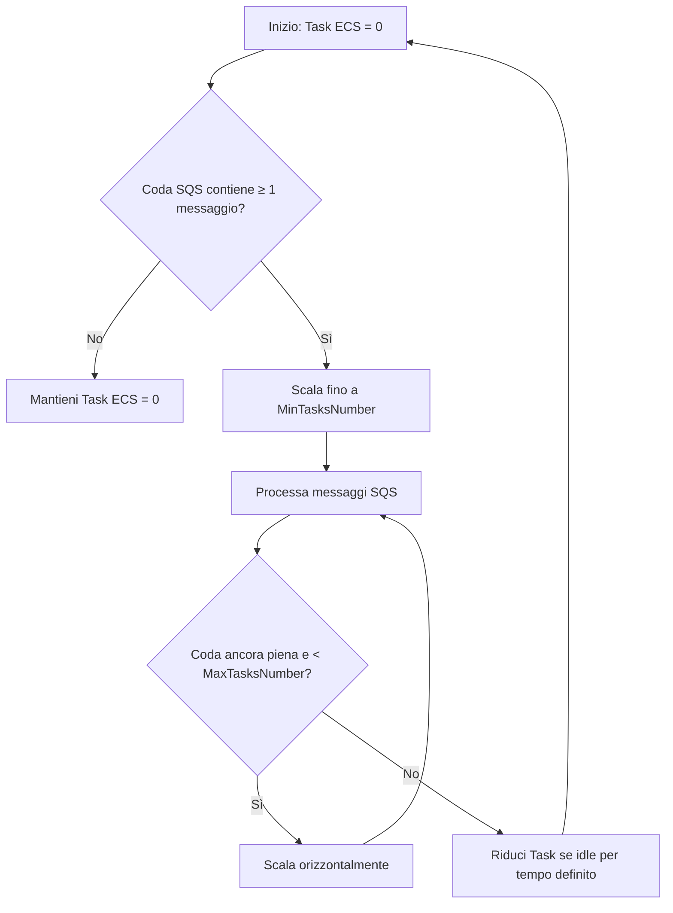
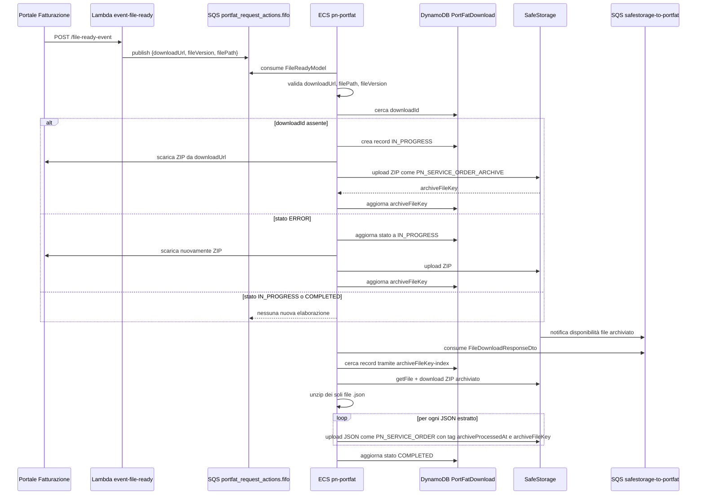
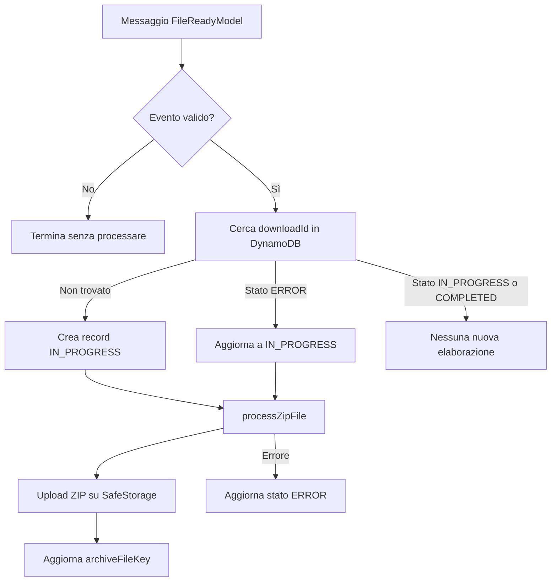

# Architettura interna pn-portfat

Questo documento descrive i flussi interni del microservizio `pn-portfat` e della Lambda `event-file-ready`, usando come fonti il codice applicativo, le specifiche OpenAPI e i template CloudFormation presenti nel repository.

Il microservizio è configurato per scalare automaticamente in base alla quantità di messaggi presenti nella coda SQS FIFO di ingresso; i parametri CloudFormation indicano `MinTasksNumber` pari a `1`, `MaxTasksNumber` pari a `6` e periodo di controllo pari a `300` secondi.



## Componenti

| Componente                              | Responsabilità                                                                                                         | Fonte                                                                                                                                                            |
|-----------------------------------------|------------------------------------------------------------------------------------------------------------------------|------------------------------------------------------------------------------------------------------------------------------------------------------------------|
| API Gateway / Lambda `event-file-ready` | Riceve l'evento HTTP di file pronto, valida il payload e pubblica un messaggio sulla coda FIFO di ingresso.            | `docs/openapi/pn-external-portfat-v1.yaml`, `functions/eventFileReady/src/app/router/apiRouter.js`, `functions/eventFileReady/src/app/service/messageService.js` |
| Coda SQS FIFO `portfat_request_actions` | Trasporta gli eventi di file pronto verso il microservizio Java; il `MessageGroupId` corrisponde al path del file.     | `functions/eventFileReady/src/app/middleware/client/sqsClient.js`, `scripts/aws/cfn/storage.yml`                                                                 |
| ECS `pn-portfat`                        | Consuma gli eventi dalla coda di ingresso, valida i dati, deduplica tramite DynamoDB e archivia lo ZIP su SafeStorage. | `src/main/java/it/pagopa/pn/portfat/middleware/queue/QueueListener.java`, `src/main/java/it/pagopa/pn/portfat/service/impl/PortFatServiceImpl.java`              |
| DynamoDB `PortFatDownload`              | Memorizza lo stato di elaborazione del download e la chiave SafeStorage dello ZIP archiviato.                          | `src/main/java/it/pagopa/pn/portfat/middleware/db/entities/PortFatDownload.java`, `scripts/aws/cfn/storage.yml`                                                  |
| SafeStorage                             | Archivia lo ZIP originale e i singoli JSON estratti; fornisce callback tramite code dedicate.                          | `src/main/java/it/pagopa/pn/portfat/service/impl/SafeStorageServiceImpl.java`, `scripts/aws/cfn/storage.yml`                                                     |
| Code `safestorage-to-portfat`           | Trasportano verso `pn-portfat` l'evento di disponibilità del file archiviato su SafeStorage.                           | `src/main/java/it/pagopa/pn/portfat/middleware/queue/SafeStorageToPortfatQueueListener.java`, `scripts/aws/cfn/storage.yml`                                      |

## Flusso end-to-end



## Ricezione evento e pubblicazione su SQS

La Lambda `event-file-ready` espone la route `POST /file-ready-event`, documentata nell'OpenAPI esterna come `POST /pn-portfat-in/file-ready-event`. Il body atteso contiene `downloadUrl` e `fileVersion`; nel codice della Lambda è supportato anche il flag opzionale `mock` per selezionare la coda mock.

La Lambda ricava `filePath` dal pathname di `downloadUrl`, compone il messaggio:

```json
{
  "downloadUrl": "https://...",
  "fileVersion": "2025-01",
  "filePath": "/ordinativi/ente1/2025-01.zip"
}
```

e lo invia a SQS con `MessageGroupId` uguale a `filePath`. La risposta applicativa in caso di accettazione è HTTP `202`.

## Consumo dell'evento di file pronto

`QueueListener` consuma la coda configurata da `pn.portfat.sqsQueue` con acknowledgement `ON_SUCCESS`. Il payload viene convertito in `FileReadyModel` e validato con queste regole:

| Campo                      | Regola                                                                             |
|----------------------------|------------------------------------------------------------------------------------|
| `downloadUrl`              | Deve essere presente e iniziare con `pn.portfat.blobStorageBaseUrl`.               |
| `filePath`                 | Deve essere presente.                                                              |
| `fileVersion`              | Deve essere presente.                                                              |
| `downloadUrl` / `filePath` | Almeno uno deve contenere una voce della whitelist `pn.portfat.filePathWhiteList`. |

Se l'evento è valido, il listener calcola il `downloadId`, cerca un record in DynamoDB e applica la seguente logica:



## Archiviazione dello ZIP originale

`PortFatServiceImpl.processZipFile` scarica lo ZIP da `downloadUrl` in un file temporaneo, calcola lo SHA-256 del file e invia il contenuto a SafeStorage con document type `PN_SERVICE_ORDER_ARCHIVE`. La chiave restituita da SafeStorage viene salvata nel record DynamoDB nel campo `archiveFileKey`.

Per il flusso mock, `processMockZipFile` archivia lo ZIP con document type `PN_SERVICE_ORDER_ARCHIVE_MOCK` e non aggiorna il record DynamoDB.

## Callback SafeStorage ed estrazione JSON

`SafeStorageToPortfatQueueListener` consuma la coda configurata da `pn.portfat.safeStorageQueue`. Il payload è un `FileDownloadResponseDto`; il campo `key` viene usato per cercare il record `PortFatDownload` tramite il GSI `archiveFileKey-index`.

Il listener recupera da SafeStorage l'URL temporaneo di download, scarica lo ZIP archiviato, estrae solo le entry con estensione `.json` e processa i file estratti. `ZipUtility` normalizza i percorsi delle entry e blocca tentativi di path traversal; se nello ZIP non sono presenti JSON, viene generato un errore applicativo.

Ogni JSON estratto viene convertito in `PortaleFatturazioneModel`, serializzato nuovamente e caricato su SafeStorage con document type `PN_SERVICE_ORDER`. I tag applicati sono:

| Tag                  | Valore                                                     |
|----------------------|------------------------------------------------------------|
| `archiveProcessedAt` | Timestamp di inizio elaborazione della directory estratta. |
| `archiveFileKey`     | Chiave SafeStorage dello ZIP originale.                    |

Al termine del flusso il record DynamoDB viene aggiornato a `COMPLETED`; in caso di errore viene aggiornato a `ERROR` con `errorMessage`.

## Stato persistito su DynamoDB

La tabella `PortFatDownload` è definita in CloudFormation con partition key `downloadId` e GSI `archiveFileKey-index` su `archiveFileKey`.

| Campo            | Uso                                                                                 |
|------------------|-------------------------------------------------------------------------------------|
| `downloadId`     | Identificativo di deduplicazione calcolato dall'evento di file pronto.              |
| `downloadUrl`    | URL da cui scaricare lo ZIP originario.                                             |
| `fileVersion`    | Versione del file ricevuta nell'evento.                                             |
| `sha256`         | Hash dello ZIP scaricato prima dell'upload su SafeStorage.                          |
| `status`         | Stato del flusso: `IN_PROGRESS`, `COMPLETED`, `ERROR`.                              |
| `createdAt`      | Timestamp di creazione del record.                                                  |
| `updatedAt`      | Timestamp dell'ultimo aggiornamento.                                                |
| `errorMessage`   | Messaggio dell'ultimo errore applicativo gestito.                                   |
| `archiveFileKey` | Chiave SafeStorage dello ZIP archiviato; usata dal GSI per la callback SafeStorage. |

## Code e risorse infrastrutturali rilevanti

| Risorsa                          | Configurazione rilevante                                                                                                     | Fonte                              |
|----------------------------------|------------------------------------------------------------------------------------------------------------------------------|------------------------------------|
| `PortFatRequestActionsQueue`     | FIFO abilitata, content based deduplication, `VisibilityTimeout` 1200 secondi, `MaxReceiveCount` 5, DLQ e allarmi abilitati. | `scripts/aws/cfn/storage.yml`      |
| `PortFatRequestActionsMockQueue` | Variante mock della coda di ingresso con configurazione FIFO equivalente.                                                    | `scripts/aws/cfn/storage.yml`      |
| `SafeStorageToPortfatQueue`      | Coda callback SafeStorage verso `pn-portfat`, `VisibilityTimeout` 60 secondi.                                                | `scripts/aws/cfn/storage.yml`      |
| `SafeStorageToPortfatMockQueue`  | Variante mock della coda callback SafeStorage.                                                                               | `scripts/aws/cfn/storage.yml`      |
| `PortFatCloudWatchDashboard`     | Dashboard con API Gateway, Lambda, code, DLQ, DynamoDB e log group.                                                          | `scripts/aws/cfn/microservice.yml` |

## Configurazioni funzionali coinvolte

| Proprietà applicativa                  | Variabile ambiente                                 | Descrizione                                                     |
|----------------------------------------|----------------------------------------------------|-----------------------------------------------------------------|
| `pn.portfat.sqsQueue`                  | `PN_PORTFAT_AWS_SQS_NAME`                          | Coda SQS FIFO degli eventi di file pronto.                      |
| `pn.portfat.sqsQueueMock`              | `PN_PORTFAT_MOCK_AWS_SQS_NAME`                     | Coda SQS FIFO mock degli eventi di file pronto.                 |
| `pn.portfat.safeStorageQueue`          | `PN_PORTFAT_SQS_SAFESTORAGETOPORTFATQUEUENAME`     | Coda callback SafeStorage verso il microservizio.               |
| `pn.portfat.safeStorageMockQueue`      | `PN_PORTFAT_SQS_SAFESTORAGETOPORTFATMOCKQUEUENAME` | Coda callback mock SafeStorage verso il microservizio.          |
| `pn.portfat.blobStorageBaseUrl`        | `PN_PORTFAT_BLOB_STORAGE_BASE_URL`                 | Base URL ammesso per validare il download dello ZIP originario. |
| `pn.portfat.filePathWhiteList`         | Configurazione applicativa                         | Lista dei path ammessi: `temp`, `portfatt`, `port-fatt`.        |
| `pn.portfat.basePathZipFile`           | Configurazione applicativa                         | Prefisso locale per la directory temporanea dei file estratti.  |
| `pn.portfat.zipExtension`              | Configurazione applicativa                         | Estensione attesa per i file ZIP temporanei: `.zip`.            |
| `pn.portfat.clientSafeStorageBasePath` | `PN_PORTFAT_SAFESTORAGEBASEURL`                    | Base URL del client SafeStorage.                                |
| `pn.portfat.safeStorageCxId`           | `PN_PORTFAT_SAFESTORAGECXID`                       | Identificativo client usato nelle chiamate SafeStorage.         |
| `aws.dynamodbPrtFatTable`              | `PN_PORTFAT_PORTFAT_TABLE_NAME`                    | Nome tabella DynamoDB `PortFatDownload`.                        |

## Osservabilità

Il servizio propaga nei log il contesto MDC derivato dagli header SQS. Se è presente `X-Amzn-Trace-Id`, viene usato come trace id; in caso contrario viene generato un UUID. I log group ECS e Lambda sono definiti nello stack `scripts/aws/cfn/storage.yml`; la dashboard CloudWatch del microservizio include riferimenti a API Gateway, Lambda, code SQS, DLQ, DynamoDB e log group.

## File sorgente principali

| Area                          | File                                                                                                                                                              |
|-------------------------------|-------------------------------------------------------------------------------------------------------------------------------------------------------------------|
| API esterna                   | `docs/openapi/pn-external-portfat-v1.yaml`                                                                                                                        |
| Lambda routing                | `functions/eventFileReady/src/app/router/apiRouter.js`                                                                                                            |
| Lambda pubblicazione SQS      | `functions/eventFileReady/src/app/service/messageService.js`, `functions/eventFileReady/src/app/middleware/client/sqsClient.js`                                   |
| Consumer evento file pronto   | `src/main/java/it/pagopa/pn/portfat/middleware/queue/QueueListener.java`                                                                                          |
| Consumer callback SafeStorage | `src/main/java/it/pagopa/pn/portfat/middleware/queue/SafeStorageToPortfatQueueListener.java`                                                                      |
| Elaborazione file             | `src/main/java/it/pagopa/pn/portfat/service/impl/PortFatServiceImpl.java`                                                                                         |
| Client SafeStorage            | `src/main/java/it/pagopa/pn/portfat/service/impl/SafeStorageServiceImpl.java`                                                                                     |
| Estrazione ZIP                | `src/main/java/it/pagopa/pn/portfat/utils/ZipUtility.java`                                                                                                        |
| Stato DynamoDB                | `src/main/java/it/pagopa/pn/portfat/middleware/db/entities/PortFatDownload.java`, `src/main/java/it/pagopa/pn/portfat/middleware/db/entities/DownloadStatus.java` |
| Infrastruttura                | `scripts/aws/cfn/storage.yml`, `scripts/aws/cfn/microservice.yml`                                                                                                 |

